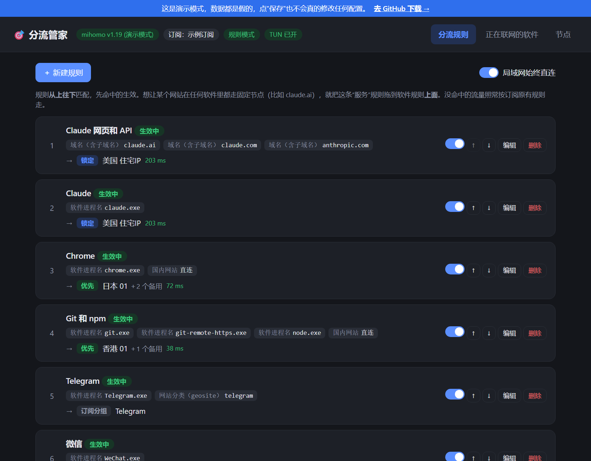
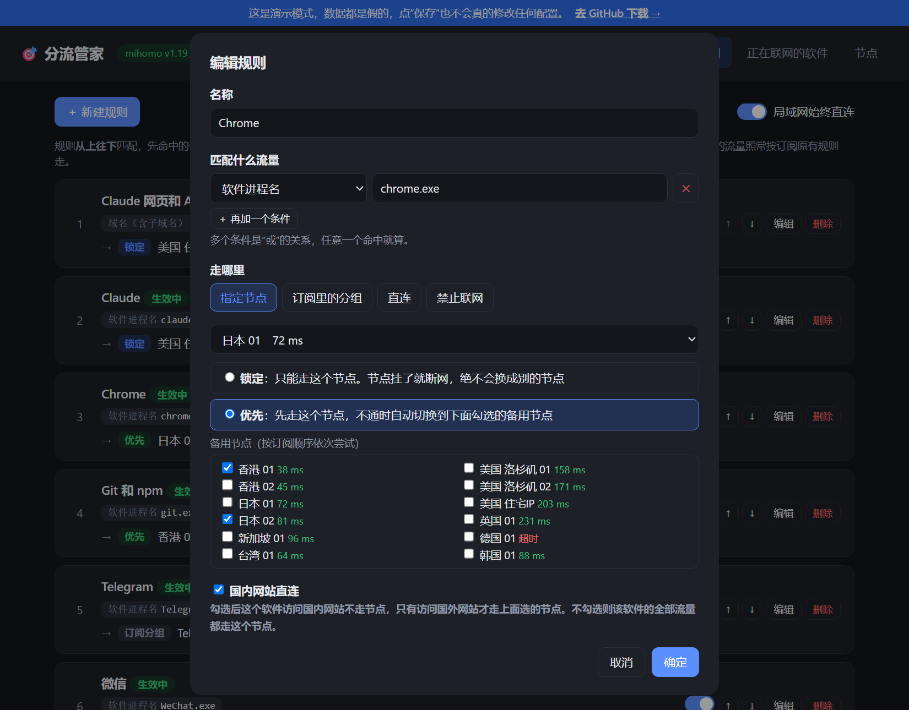
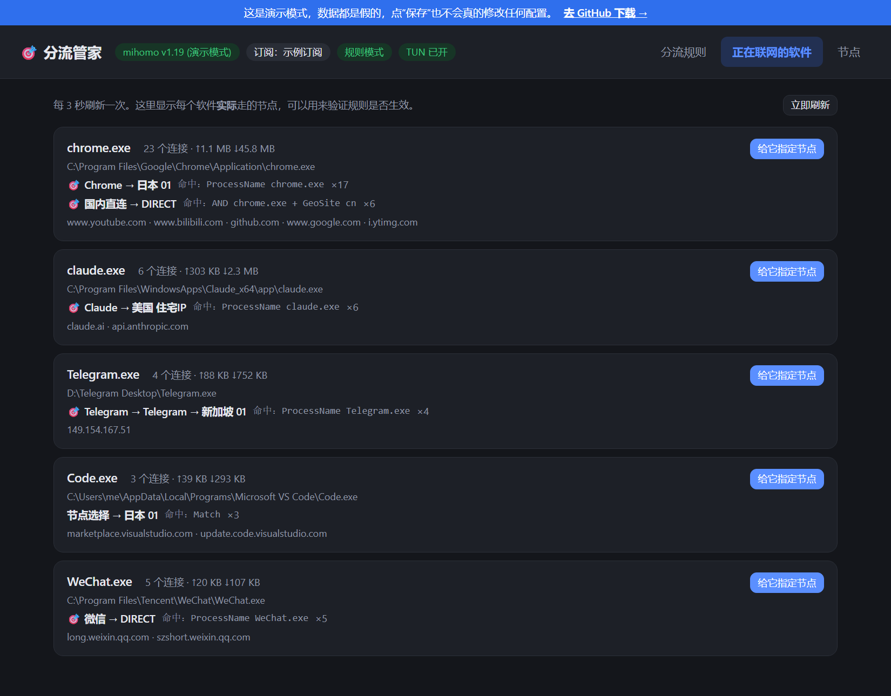

<div align="center">

[简体中文](README.md) | [English](README.en.md) | [繁體中文](README.zh-TW.md) | [日本語](README.ja.md) | [한국어](README.ko.md) | **Русский**

# 🎯 proxy-router

**Визуальный менеджер «какое приложение через какой узел» для Clash Verge Rev**

Chrome — через Японию, Claude — жёстко через резидентный IP США, Git — через Гонконг, WeChat — напрямую. Настраивается в пару кликов и применяется сразу после сохранения.


### [👉 Онлайн-демо (без установки)](https://ricklisfdsdf.github.io/proxy-router/)

</div>

> **Примечание:** веб-интерфейс пока только на упрощённом китайском. Помощь с переводом приветствуется.



## Зачем

Clash умеет маршрутизировать по процессам (`PROCESS-NAME`), но на практике приходится:

- Писать правила в YAML вручную, помнить порядок правил и синтаксис прокси-групп
- Терять свои правки при каждом обновлении подписки (или разбираться со скриптами расширения / Merge)
- Перебирать список соединений, чтобы понять, работает ли правило
- Самому собирать прокси-группы, если нужно «только этот узел: упал — связи нет, никаких утечек через другие узлы»

**proxy-router делает всё это за вас**: выбрали приложение, выбрали узел, нажали «сохранить».

## Возможности

| | |
|---|---|
| 🖥️ **По приложениям** | Имя процесса или регулярное выражение по пути. Например, Claude Desktop и Claude Code (оба `claude.exe`) можно развести по разным узлам |
| 🌐 **По сервисам** | Домен, ключевое слово домена, категория geosite, диапазон IP, порт |
| 🔒 **Жёсткая привязка к узлу** | Используется только выбранный узел; если он недоступен, соединение не устанавливается и **никогда не уходит через другой узел** (для чувствительных к IP сервисов: AI, платежи, аккаунты) |
| 🔁 **Основной + резервные** | Автоматическое переключение на выбранные резервные узлы |
| 🇨🇳 **Китайские сайты напрямую** | Даже если приложение идёт через прокси, сайты из материкового Китая открываются напрямую |
| 👀 **Проверка в реальном времени** | Видно, через какую цепочку **на самом деле** идёт каждое приложение и какое правило сработало; назначить узел любому активному приложению в один клик |
| ⚡ **Мгновенное применение** | Проверка через `mihomo -t`, затем горячая перезагрузка — без перезапуска Clash Verge |
| 🛡️ **Переживает обновление подписки** | Правила хранятся в глобальном скрипте расширения Clash Verge; узлы, которых нет в новой подписке, пропускаются, конфиг не ломается |
| 📋 **Шаблоны** | Chrome / Edge / Claude / ChatGPT / Gemini / Telegram / VS Code / Cursor / Git / npm / pip / Steam / Discord… |

<table>
<tr>
<td></td>
<td></td>
</tr>
<tr>
<td align="center">Правило: привязка / основной + резервные</td>
<td align="center">Какой узел реально использует каждое приложение</td>
</tr>
</table>

## Быстрый старт

**Требования:** Windows + [Clash Verge Rev](https://github.com/clash-verge-rev/clash-verge-rev) (ядро mihomo) + Python 3.10+

```bash
git clone https://github.com/RickLisfdsdf/proxy-router.git
cd proxy-router
pip install -r requirements.txt
python app.py
```

Откройте <http://127.0.0.1:9123>. В дальнейшем можно запускать в фоне двойным щелчком по `启动分流管家.vbs`.

**Рекомендуется:** включить в Clash Verge **режим TUN** и использовать **режим правил**. Без TUN консольные программы, игнорирующие системный прокси (git, npm, Claude Code…), не будут перехвачены.

## Как это работает

```
Правила в веб-интерфейсе ─▶ rules.json
                               │
                               ├─▶ Глобальный скрипт расширения Clash Verge Script.js (сохраняется после обновлений/перезапуска)
                               │
                               └─▶ Патч текущего конфига ─▶ verge-mihomo -t ─▶ горячая перезагрузка через именованный канал
```

- Для каждого правила создаётся прокси-группа с префиксом `🎯 ` — она видна и на странице прокси в Clash Verge
- Привязка = группа `select` с одним узлом; основной + резервные = группа `fallback`
- «Китайские сайты напрямую» реализовано логическими правилами вида `AND,((PROCESS-NAME,xxx),(GEOSITE,cn))`
- При первом сохранении исходный глобальный скрипт сохраняется как `Script.js.before-proxy-router`
- Общается только с локальным mihomo, ничего никуда не отправляет

## Вопросы и ответы

<details>
<summary><b>Важен ли порядок правил?</b></summary>

Да: правила проверяются сверху вниз, срабатывает первое совпадение. Чтобы claude.ai в любом браузере шёл через один узел, поставьте **доменное** правило «Claude web» выше правила **приложения** «Chrome».
</details>

<details>
<summary><b>Правила самой подписки продолжают работать?</b></summary>

Да. Ваши правила лишь вставляются в начало; всё, что под них не попало, обрабатывается правилами подписки как раньше.
</details>

<details>
<summary><b>macOS / Linux?</b></summary>

Пока только Windows (используется именованный канал и пути конфигурации Clash Verge Rev для Windows). PR приветствуются.
</details>

## Поддержать

Если проект сэкономил вам время, **поставьте ⭐ Star** — так его найдут другие с той же задачей.

Ошибки и идеи — в [Issues](https://github.com/RickLisfdsdf/proxy-router/issues).

## License

[MIT](LICENSE)
